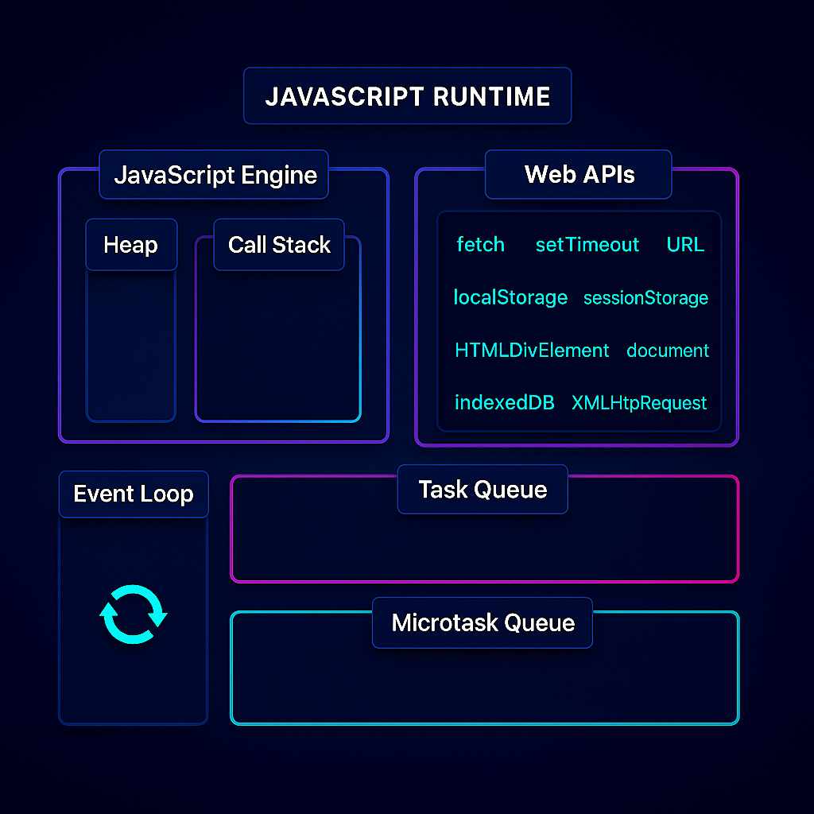

#### **JavaScript Engine**
- **Call Stack:** a stack data structure that keeps track of function calls and pops them on return. **Synchronous code** is executed here line by line.
- **Heap:** unstructured memory pool for dynamic allocation of **objects**, **functions**, and **reference types**.

<hr class="hr-light" />

#### **Web APIs (In the Browser)**
These are features provided by the web browsers, which includes:
- **Timer APIs:** `setTimeout`, `setInterval`, `clearTimeout`, `clearInterval`, etc.
- **Networking APIs:** Ajax / `fetch`, `WebSocket`, `XMLHttpRequest`, `EventSource`, etc.
- **DOM Events:** `addEventListener`, drag & drop APIs, clipboard API, etc.
- **Media APIs:** camera / mic access, `MediaRecorder`, `video.play()`, etc.
- **Storage & Persistence:** `localStorage` / `sessionStorage`, Cache API, cookies
- **Web Workers & Shared Workers**
- **Security & Permissions**

They run **asynchronously** when you call them, they then notify the **JavaScript Engine** when they are done through the **Task Queue** or **Microtask Queue**.

<hr class="hr-light" />

#### **Event Loop**
It Orchestrates **async execution** by continuously checking:
1. **Check Call Stack** - If empty, proceed to next step
2. **Process ALL Microtasks** - Empty the entire microtask queue
3. **Process ONE Task** - Take the oldest task from task queue
4. **Repeat** - Return to step 1

<hr class="hr-light" />

#### **Task Queue**
Also known as the **Callback Queue** or **Macrotask Queue**. It stores callbacks from from functions which have processed in the **Web API**.

<hr class="hr-light" />

#### **Microtask Queue**
It has higher priority than the **Task Queue** and stores:
- **Promise callbacks** (`.then`, `.catch`, `.finally`)
- **`queueMicrotask()`** executions
- **`MutationObserver`** callbacks
It is **processed completely** - queue must be empty before moving on

---

#### **Execution Example**

```javascript
console.log('Start');                                 // Call Stack
setTimeout(() => console.log('Timeout'), 0);          // Task Queue  
Promise.resolve().then(() => console.log('Promise')); // Microtask Queue
console.log('End');                                   // Call Stack

// Output: Start → End → Promise → Timeout