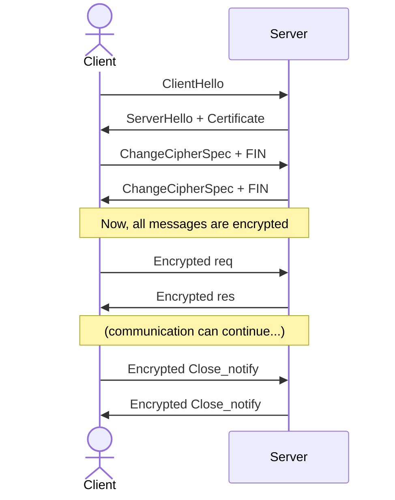
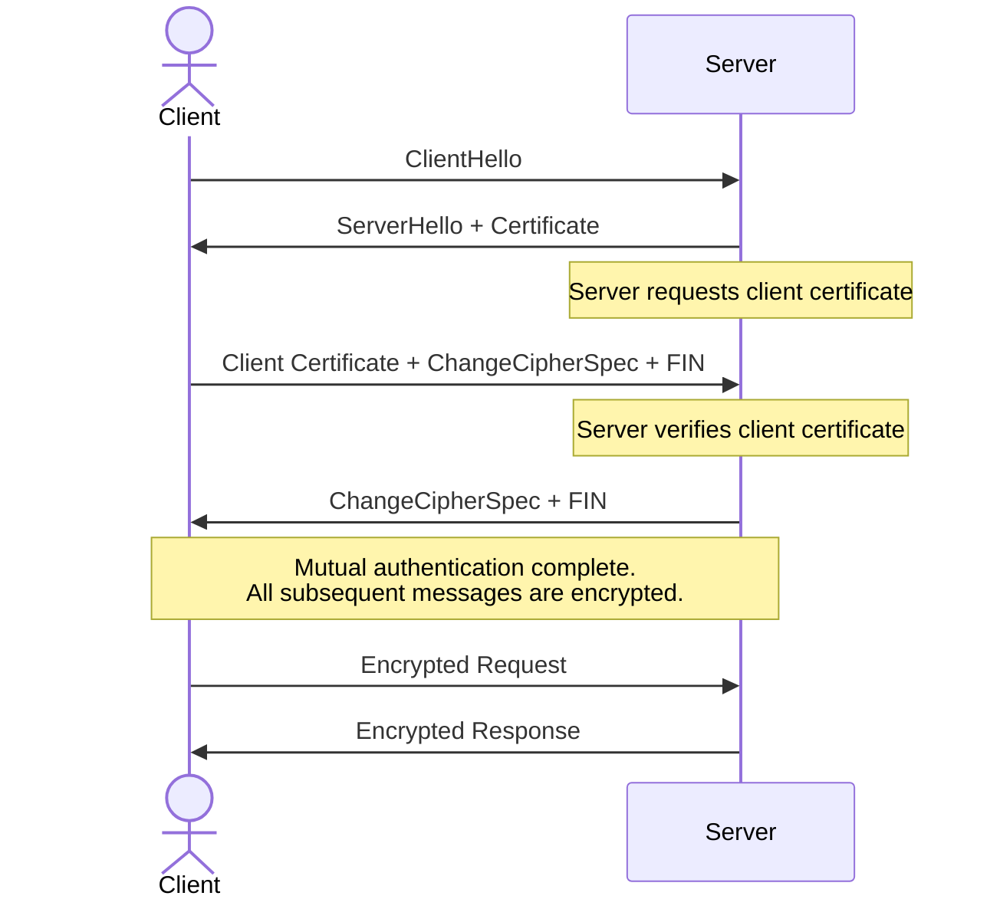

A cryptographic protocol that ensures secure communication over a network by providing encryption, authentication, and data integrity. It operates above [TCP](./2.05%20Transmission%20Control%20Protocol%20(TCP).md), encrypting data to prevent eavesdropping and tampering while using certificates to verify authenticity commonly used in [HTTPS](./2.07%20Hyper%20Text%20Transfer%20Protocol%20(HTTP).md).

- **TLS 1.2**
	- **Flow:** first the client sends a hello message which contains the TLS version, a random value used for key generation, supported cipher suites (encryption algorithm), extensions, and supported compression methods. Then the server responds with its hello message which contains the same data as the client hello plus the server certificate. After that the client verifies the server's certificate and uses it to generate a shared secret key (using [RSA](../Cryptography/RSA.md) or [Diffie-Hellman](../Cryptography/Diffie-Hellman.md)). Then both client and server derive the encryption keys and send a final confirmation message. Finally encrypted data exchange begins using the agreed-upon keys and cipher suite.
- **TLS 1.3**
	**Flow:** simplified and faster. The client guesses which key exchange protocol the server will use and sends a "key share" in its first message. The server responds with its key share, certificate, and `Finished` message in one round trip. Session keys are derived immediately. This **1-RTT handshake** is a major performance gain over **TLS 1.2**. Older, insecure algorithms are removed.

#### **Notes**

- Older versions like **TLS 1.0** and **TLS  1.1**, as well as **SSL (Secure Sockets Layer)** versions **2.0** and **3.0** are all considered outdated and insecure due to vulnerabilities like weak encryption algorithms.

---

#### **Mutual TLS (mTLS)**
A security enhancement to standard TLS that enforces **two-way authentication**. Unlike regular TLS where only the server proves its identity to the client, mTLS requires the client to also present a certificate and prove its identity to the server. This creates a mutually authenticated, encrypted channel.

#### **How mTLS Works**
The handshake follows the standard TLS flow but adds a critical step:
1. **Standard Server Authentication:** the client connects, and the server presents its certificate as in normal TLS.
2. **Client Certificate Request:** the server sends a `CertificateRequest` message, demanding the client to authenticate itself.
3. **Client Authentication:** the client must respond with its own certificate. The server then verifies this client certificate against its own **trust store** (a list of trusted Certificate Authorities or specific client certificates).
4. **Handshake Completion:** the TLS handshake only completes if **both** the server's certificate _and_ the client's certificate are successfully verified. If the client fails to provide a valid certificate, the connection is aborted.

#### **Why Use mTLS? Key Advantages**
- **Eliminates Credential-Based Attacks:** protects against threats like phishing, API key leakage, and credential stuffing. Even if an attacker steals a password or API token, they cannot authenticate without the corresponding client certificate.
- **Strong Service Identity in Microservices:** in a backend microservices architecture, mTLS ensures that only authorized services can communicate with each other. For example, you can configure an API Gateway to only accept connections from services presenting certificates for `service-a.example.com` and `service-b.example.com`.
- **Network-Agnostic Authorization:** access control is based on cryptographic identity, not IP addresses. A client with a valid certificate can connect from any network location, simplifying network security rules compared to maintaining complex IP whitelists.

#### **Challenges and Drawbacks**
- **Client Certificate Management Overhead:** managing the lifecycle (issuance, renewal, revocation) for a large number of client certificates is complex and requires a robust **Public Key Infrastructure (PKI)**. This is a significant operational cost.
- **Not Ideal for the Public Internet:** the model of issuing and managing a certificate for every potential user (e.g., every website visitor) is impractical at internet scale. mTLS is primarily used in controlled environments like internal APIs, service meshes, and machine-to-machine (M2M) communication.
- **Potential for Misconfiguration:** if mTLS is only enforced between internal services but a public-facing endpoint proxies requests inward without validating the client's identity, an attacker can bypass the protection. Security must be consistent across the entire chain.

#### **Real-World Examples**
- **Service Meshes:** technologies like Istio and Linkerd use mTLS by default to encrypt and authenticate all traffic between service pods in a cluster.
- **Internal APIs:** backend services within a corporate network (e.g., a billing service talking to a database) often use mTLS to ensure that only permitted services can access sensitive endpoints.
- **Zero Trust Networks:** mTLS is a foundational technology for Zero Trust architectures, where no entity is trusted by default, and every request must be verified.