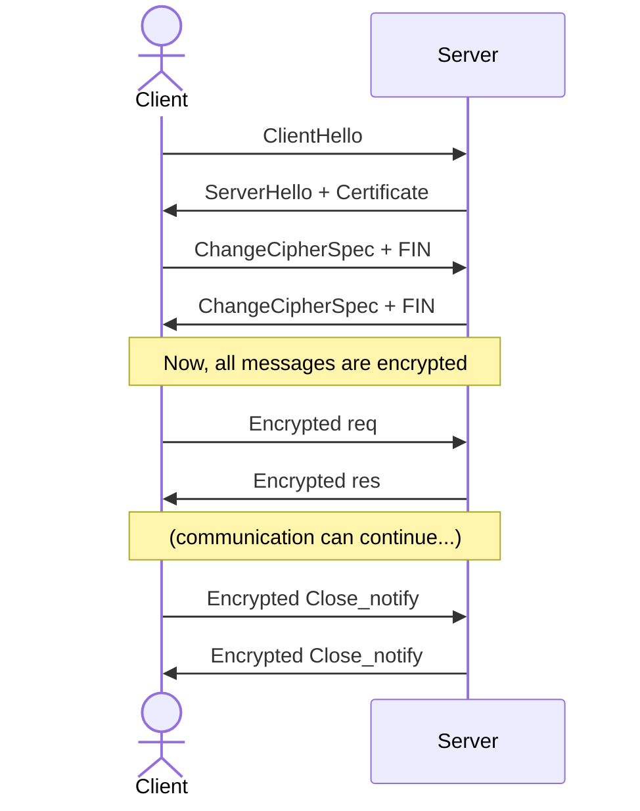

A cryptographic protocol that ensures secure communication over a network by providing encryption, authentication, and data integrity. It operates above [TCP](./2.05%20Transmission%20Control%20Protocol%20(TCP).md), encrypting data to prevent eavesdropping and tampering while using certificates to verify authenticity commonly used in [HTTPS](./2.07%20Hyper%20Text%20Transfer%20Protocol%20(HTTP).md).

- **TLS 1.2**
	- **Flow:** first the client sends a hello message which contains the TLS version, a random value used for key generation, supported cipher suites (encryption algorithm), extensions, and supported compression methods. Then the server responds with its hello message which contains the same data as the client hello plus the server certificate. After that the client verifies the server's certificate and uses it to generate a shared secret key (using [RSA](../Cryptography/RSA.md) or [Diffie-Hellman](../Cryptography/Diffie-Hellman.md)). Then both client and server derive the encryption keys and send a final confirmation message. Finally encrypted data exchange begins using the agreed-upon keys and cipher suite.
- **TLS 1.3**
	**Flow:** simplified and faster. The client guesses which key exchange protocol the server will use and sends a "key share" in its first message. The server responds with its key share, certificate, and `Finished` message in one round trip. Session keys are derived immediately. This **1-RTT handshake** is a major performance gain over **TLS 1.2**. Older, insecure algorithms are removed.

---

#### **Notes**

- Older versions like **TLS 1.0** and **TLS  1.1**, as well as **SSL (Secure Sockets Layer)** versions **2.0** and **3.0** are all considered outdated and insecure due to vulnerabilities like weak encryption algorithms.