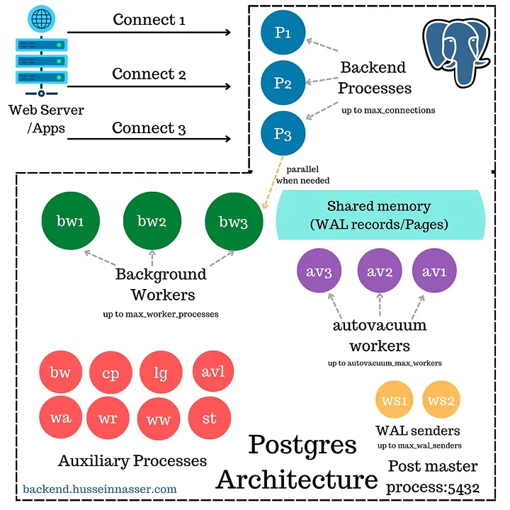

SQL databases, epitomized by systems like PostgreSQL and MySQL, have been the cornerstone of enterprise applications for decades. They are renowned for their adherence to the ACID properties, rigid schema enforcement, and the powerful, declarative SQL query language. While their table-based relational model is their most visible feature, their robustness stems from sophisticated internal architectures designed for reliability and concurrent access.

#### **Core Components of a SQL Database**
- **Front end (SQL Parser & Planner)**: accepts SQL queries, parses them, and creates an optimal execution plan.
- **Storage Engine**: manages how data is stored on disk, handles caching, transactions, and crash recovery. Unlike many NoSQL systems, some SQL databases (like MySQL) allow pluggable storage engines.

The defining characteristic of SQL databases is not just the storage layer, but the complex process-based or thread-based architecture that orchestrates client connections, query execution, and background maintenance.

---

### **PostgreSQL's Architecture**
PostgreSQL is a process-based, open-source relational database known for its strict standards compliance and advanced features. Its architecture is a collection of cooperating processes, each with a dedicated role, centered around a key concept: **Multi-Version Concurrency Control (MVCC)** via an append-only model. Instead of updating rows in-place, changes create new row versions (tuples), leaving old ones to be cleaned up later by a process called `VACUUM`.

webp
#### **Key PostgreSQL Processes**
The system is orchestrated by a master process called the **postmaster**:
- **Postmaster Process**: the first process started. It listens for client connections on a port (default 5432) and is the parent of all other processes.
- **Backend Processes**: for each client connection, the postmaster forks a new backend process. This is a simple but potentially expensive design, which is why the number of connections is capped by the `max_connections` setting (default 100). Each process handles query parsing, execution, and transaction management for its single client.
- **Shared Memory**: a critical block of memory accessible by all processes. It contains the **shared buffers** (cache for database pages) and the **Write-Ahead Log (WAL)** buffers, ensuring all processes see a consistent view of the data.

#### **Auxiliary & Background Processes**
Several helper processes manage maintenance and durability:
- **Background Writer**: periodically flushes dirty pages (modified data in shared buffers) to the operating system's disk cache. Its goal is to free up space in shared buffers, not to guarantee durability.
- **Checkpointer**: creates consistency points by forcing _all_ dirty pages and WAL records directly to disk (bypassing the OS cache). This establishes a recovery point.
- **WAL Writer**: ensures WAL records are flushed to disk frequently. This is critical for transaction durability, a commit only returns to the client after its WAL records are safely on disk.
- **Auto Vacuum Launcher & Workers**: MVCC creates dead tuples. The AVL spawns worker processes to remove these tuples and reclaim space, preventing database bloat.
- **WAL Sender/Receiver & Archiver**: handle streaming WAL data to replicas for replication and archiving WAL segments for point-in-time recovery.
- **Startup Process**: the _first_ process to run after a crash. It replays WAL records from the last checkpoint to bring the database back to a consistent state before allowing client connections.

This multi-process model prioritizes stability and isolation but introduces overhead compared to thread-based models.

---

### **MySQL's (InnoDB) Architecture**
MySQL is a popular SQL database that supports multiple [storage engines](./11.%20Database%20Engines.md). Its default and most widely used engine is **InnoDB**, which has a very different, thread-based architecture focused on high performance and crash recovery.

#### **Key InnoDB Components**
- **Thread-Based Model**: instead of one OS process per connection, InnoDB uses a pool of threads to handle client requests, which is more resource-efficient.
- **Buffer Pool**: the heart of InnoDB, equivalent to PostgreSQL's shared buffers. It caches data and index pages in memory.
- **Undo Logs & Redo Logs**: InnoDB uses a different MVCC approach. Instead of an append-only model, it updates data in-place and uses **undo logs** to store old row versions for active transactions. The **redo log** (similar to PostgreSQL's WAL) records all changes for durability.
- **Pluggable Storage Engines**: a unique MySQL feature. Engines like InnoDB (transactional), MyISAM (non-transactional), or Memory handle storage, while the MySQL server layer manages SQL parsing and client connections.

#### **The InnoDB Storage Engine Internals**
- **Doublewrite Buffer**: a safety feature to prevent partial page writes. Pages are first written sequentially to a special doublewrite buffer area, and then copied to their final tablespace location. This ensures crash recovery can fix corrupted pages.
- **Adaptive Hash Index**: InnoDB can automatically build in-memory hash indexes on frequently accessed data to speed up B-Tree lookups.
- **Change Buffer**: caches changes to secondary indexes when the corresponding pages are not in the buffer pool. These changes are merged later when the pages are read into memory, reducing random I/O.

The lookup path for a row by its primary key is a direct B-Tree traversal, as the primary key is a **clustered index**, meaning the row data is stored in the leaf nodes of the primary key B-Tree.

---

#### **How PostgreSQL and InnoDB Implement MVCC**
This is a fundamental architectural difference:
- **PostgreSQL (Append-Optimized)**: `UPDATE` creates a new tuple; `DELETE` marks a tuple as dead. Reads must ignore non-visible tuples. This can lead to table bloat, requiring `VACUUM`.
- **InnoDB (In-Place with Undo Logs)**: `UPDATE` changes the data in-place but writes the old version to an **undo log**. Reads use the undo log to reconstruct a consistent view of old data. This avoids bloat but puts pressure on the undo log storage.

#### **Clarifications & Terminology**
- **PostgreSQL**: instead of just calling it “append-only,” it’s clearer to describe it as _heap storage with MVCC tuple versions_. Updates create new tuples in the heap and leave old ones for `VACUUM` cleanup. This avoids blocking readers but can cause table bloat if vacuuming lags.
    \* Also, note that the **WAL Writer** flushes WAL records from shared memory to durable disk, while the **Checkpointer** flushes dirty data pages. This distinction matters because WAL durability guarantees come before the actual data pages are forced to disk.
- **MySQL (InnoDB)**: its **redo log** is not just a transient buffer, it’s a persistent log that ensures crash recovery by replaying committed changes.
    The **doublewrite buffer** is a separate safety mechanism (not part of the redo log). Modified pages are first written sequentially into the doublewrite area, and then copied to their final tablespace locations. This prevents corruption from partial page writes.

#### **Comparing the Architectural Philosophies**

|Feature|PostgreSQL|MySQL (InnoDB)|
|---|---|---|
|**Concurrency Model**|Process-based|Thread-based|
|**MVCC Implementation**|Append-only new tuples|In-place updates with undo logs|
|**Primary Key Lookup**|Index (B-Tree) to Tuple in Heap|Direct via Clustered Index|
|**Crash Recovery**|Replay WAL from last checkpoint|Use redo log to replay, undo log to rollback|
|**Strengths**|Stability, complex queries, data integrity|High concurrency, performance, scalability|
|**Trade-offs**|Higher per-connection overhead, VACUUM maintenance|Undo log management, more complex internal locking|

---

#### **Pros**
- **ACID Compliance**: strong guarantees for data integrity, even during failures.
- **Powerful Query Language (SQL)**: rich, declarative language for complex queries, joins, and aggregations.
- **Mature Ecosystem**: extensive tooling, monitoring, and administrative support built up over decades.
- **Data Integrity**: rigid schemas and constraints ensure data quality and reliability.

#### **Cons**
- **Scaling Complexity**: vertical scaling (bigger server) has limits. Horizontal scaling (sharding) is often complex and application-dependent.
- **Operational Overhead**: tuning (memory, vacuum/undo, locks) requires deep expertise for high performance.
- **Less Schema Flexibility**: schema changes (ALTER TABLE) can be expensive and blocking on large tables, though this has improved.
- **Connection Scaling**: the process-per-connection model in PostgreSQL can limit the number of concurrent connections compared to thread-pooled architectures.